

<h1>Hi, I'm miku mifa 👋</h1>

 

  
  

  <em>Just a programmer, building useful tools, exploring interesting ideas, and turning thoughts into code.</em>

 

<table>
  <tr>
    <td>
      
    </td>
    <td>
      
    </td>
  </tr>
</table>

## 🧪 Research / Papers

  
  
  
  
  

 

## 🎮 Game / Ticket / Automation

  
  
  
  
  

 

## 🌸 Anime / Bilibili / Media Tools

  
  
  
  
  
  

 

## 🛠️ Full-stack / Apps

  
  
  
  

 

## ⚙️ Backend / DevOps / Infra

  
  
  
  
  

 

## 📚 Course / Learning Projects

  
  
  

 

## 🧩 Misc / Fun Projects

  
  
  
  

