<div align="center">

  <div style="display: inline-flex; align-items: center; gap: 18px;">
    
    <h1>Hi, I'm miku mifa 👋</h1>
  </div>

  <p>
    <a href="mailto:1055069518@qq.com">
      
    </a>
    
  </p>

  <p>
    <em>Just a programmer, building useful tools, exploring interesting ideas, and turning thoughts into code.</em>
  </p>

</div>

<br/>

<div align="center">
  
  
</div>

<br/>

## 🎮 Useful Tools

<div align="center">
  <div style="max-width: 900px; text-align: left;">
    
    
    
    
    
    
    
  </div>
</div>

## 🧪 Research

<div align="center">
  <div style="max-width: 900px; text-align: left;">
    
    
    
  </div>
</div>

## 🌸 Game Tools

<div align="center">
  <div style="max-width: 900px; text-align: left;">
    
    
    
    
  </div>
</div>

## ⚙️ Other Tools

<div align="center">
  <div style="max-width: 900px; text-align: left;">
    
    
    
    
    
    
  </div>
</div>
```
